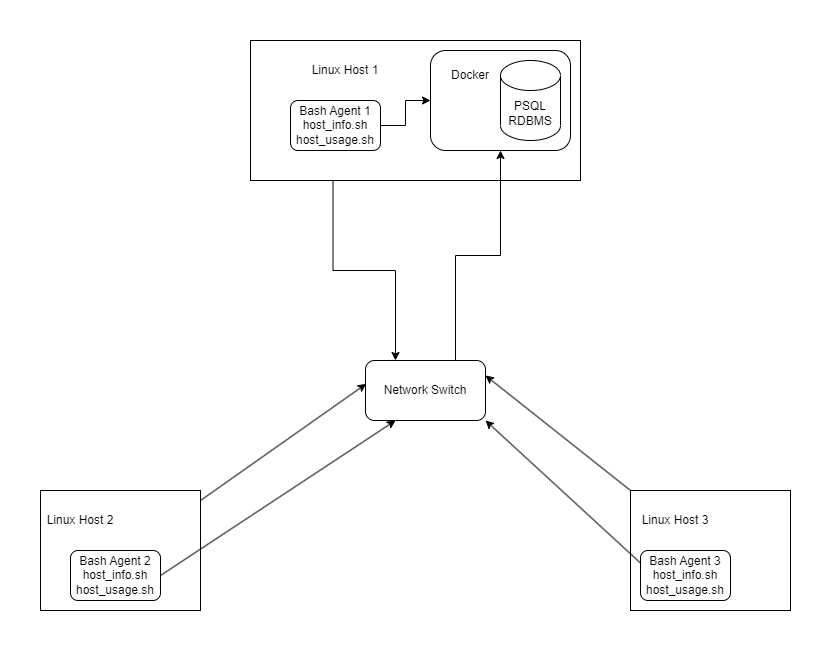

# Linux Cluster Monitoring Agent
# Introduction
The Linux Cluster Monitoring Agent gathers hardware information of the server, and monitors its resource usage every minute. The gathered data is then stored in a PostgreSQL relational database to be used for future resource and planning purposes.

## Who are the users?
The users of this project are the Jarvis Linux Cluster Administration. They possess the responsibility to manage the Linux cluster consisting of 10 nodes/servers running CentOS 7. The LCA team requires the hardware specifications and resource usage of each node to be collected and stored in an PostgreSQL RDBMS. This data then can be used to generate reports for future planning purposes or any other needs.

## Which technologies are used?
The technologies used in the implementation of this project are listed below:
* **Git & Github:** Manage code versions locally, and store it remotely on Github
* **Google Cloud Platform (GCP):** Used to provision to VM running Linux distro CentOS 7.
* **Docker:** To provision the PostgreSQL instance
* **Bash:** Used to implement the project features
* **PostgreSQL:** To store hardware specifications and resource usage.


# Quick Start
**Required Packages**
* Docker
* PostgreSQL 

Use "psql_docker.sh" file to create, start, or stop PostgreSQL instance.
```bash
# script usage
./scripts/psql_docker.sh start|stop|create [db_username] [db_password]

#create instance
./scripts/psql_docker.sh create <db_username> <db_password>

#Start psql docker container
./scripts/psql_docker start

#Stop psql docker container
./scripts/psql_docker stop
```

The following commands can be used to connect to the PSQL instance and setup database:
```bash
#connect to the psql instance
psql -h localhost -U postgres -d postgres -W

# create database called host_agent
postgres=# CREATE DATABASE host_agent;

# list all databases
postgres=# \l
```

After successful connection to the database, execute "ddl.sql" script on host_agent database to create "host_info" and "host_usage" tables if they are not created already:
```bash
#Execute ddl.sql on host_agent database to create two tables "host_info" and "host_usage"
psql -h localhost -U postgres -d host_agent -f sql/ddl.sql
```
Insert hardware specs data into the DB using host_info.sh:
```bash
# script usage
./scripts/host_info.sh <psql_host> <psql_port> <db_name> <psql_user> <psql_password>

# example
./scripts/host_info.sh localhost 5432 host_agent postgres <your_password>
```
Insert hardware usage data into the DB using host_usage.sh:
```bash
# script usage
./scripts/host_usage.sh <psql_host> <psql_port> <db_name> <psql_user> <psql_password>

# example
./scripts/host_usage.sh localhost 5432 host_agent postgres <your_password>
```
Check to make sure the data is inserted correctly by the scripts:
```bash
# connect to host_agent database
psql -h localhost -U postgres -d host_agent -W

# retrieve all data from host_info
host_agent=# SELECT * FROM host_info;

# retrieve all data from host_usage
host_agent=# SELECT * FROM host_usage;
```
Automate process using Crontab
```bash
#edit crontab file
crontab -e

# add the following command to the crontab file to run host_usage.sh every minute
* * * * * <absolute path of host_usage.sh> <psql_host> <psql_port> <db_name> <psql_user> <psql_password> > [log directory]

#for example
* * * * * bash /home/centos/dev/jarvis_data_eng_sourav/linux_sql/scripts/host_usage.sh localhost 5432 host_agent postgres password > /tmp/host_usage.log
```

# Implemenation
1. Constructed a Linux server that runs CentOS 7 on Google Cloud Platform (GCP).
2. Installed Docker and provisioned a PostgreSQL Docker container by pulling the PostgreSQL image from Docker Hub.
3. Created and implemented ```psql_docker.sh``` script to create, start, and/or stop the container.
4. Setup database through the PSQL CLI
5. Create and implement ```ddl.sql``` script to create two tables ```host_info``` and ```host_usage``` to store hardware specifications and resource usage data.
6. Create and implement ```host_info.sh``` and ```host_usage.sh``` to gather hardware information and host usage data and store it into the database.
7. Use crontab to automate ```host_usage.sh``` script every minute.
## Architecture

## Scripts
Shell script description and usage
1. ```psql_docker.sh``` can create, stop or start the PostgreSQL instance within the docker container. The script accepts three parameters which are username, password, and the input command.
2. ```host_info.sh``` collects hardware specifications obtained from the ```lscpu``` command and stores the information into the host_info table in the database. It takes 5 inputs which are PSQL host, PSQL port, database name, username, and password.
3. ```host_usage.sh``` collects server resource usage obtained from the ```vmstat``` command and inserts it into the host_usage table. It takes 5 inputs which are PSQL host, PSQL port, database name, username, and password.
4. ```crontab``` used to automate the execution of the ```host_usage.sh``` script every minute via a command that is added to the crontab file.

## Database Modeling
 Schema for `host_info`

  | Column Name      | Data Type |                    Constraints |
  |------------------|:---------:|-----------------------:|
  | id               |  SERIAL   |          NOT NULL, PRIMARY KEY |
  | hostname         |  VARCHAR  |                       NOT NULL |
  | cpu_number       |   INT2    |                       NOT NULL |
  | cpu_architecture |  VARCHAR  |                       NOT NULL |
  | cpu_model        |  VARCHAR  |                       NOT NULL |
  | cpu_mhz          |  FLOAT8   |                       NOT NULL |
  | l2_cache         |   INT4    |    NOT NULL            |
  | timestamp        | TIMESTAMP |                        |
  | total_mem        |   INT4    | |

- Schema for `host_usage`

| Column Name | Data Type |                                                     Constraints |
|--|:---------:|----------------------------------------------------------------:|
| timestamp | TIMESTAMP |                                                        NOT NULL |
| host_id |  SERIAL   |                  NOT NULL, FOREIGN KEY REFERENCES host_info(id) |
| memory_free |   INT4    |            NOT NULL                                          $1 |
| cpu_idle |   INT2    |        NOT NULL                                            Cool |
| cpu_kernel |   INT2    |      NOT NULL                                            -----: |
| disk_io |   INT4    |     NOT NULL                                              $1600 |
| disk_available |   INT4    | NOT NULL                                                    $12 |
# Test
How did you test your bash scripts DDL? What was the result?

The bash scripts were tested manually and in the following manner:
1. testing `psql_docker.sh`
    ```bash
   #create postgres container with username and password
   ./scripts/psql_docker.sh create postgres <password>
   
   #verify container "jrvs-psql" is up and running
   docker container ls -a -f name=jrvs-psql
    ```
2. testing `host_info.sh`
    ```bash
   # run host_info.sh
   ./scripts/host_info.sh localhost 5432 host_agent postgres <your_password>
   
   #connect to the database
   psql -h localhost -U postgres -d host_agent -W
   
   #verify data was actually installed with the proper columns populated
   SELECT * FROM host_info;
    ```
3. testing `host_usage.sh`
    ```bash
   # run host_usage.sh
   ./scripts/host_info.sh localhost 5432 host_agent postgres <your_password>
   
   #connect to the database
   psql -h localhost -U postgres -d host_agent -W
   
   #verify data was actually installed with the proper columns populated
   SELECT * FROM host_usage LIMIT 1;
    ```
4. testing if `crontab` is working correctly
    ```bash
   # print 3 records from the host usage table and verify the timestamps to be one minute apart
   SELECT * FROM host_usage ORDER BY timestamp LIMIT 3;
    ```

# Deployment
The app was deployed using crontab where the data collection process is automated using the command:
```* * * * * bash /path to host_usage.sh localhost 5432 db_name db_user db_password > /tmp/host_usage.log```. It collected data every minute and stored into a PostgreSQL database.
# Improvements

- Handle hardware updates
- GUI to display data in a visually pleasing manner
- Set up alerts wherever there seems to be performance issues
